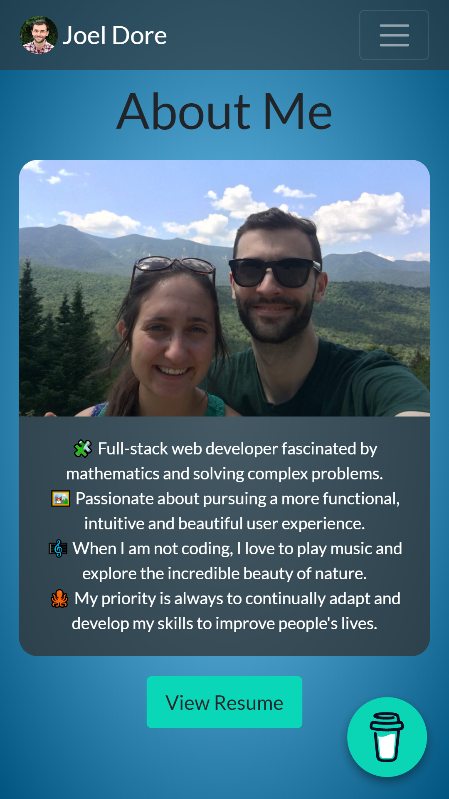
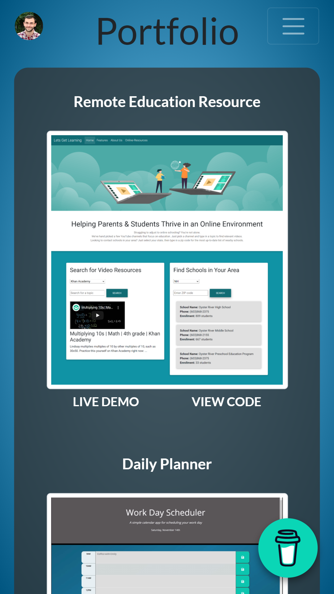
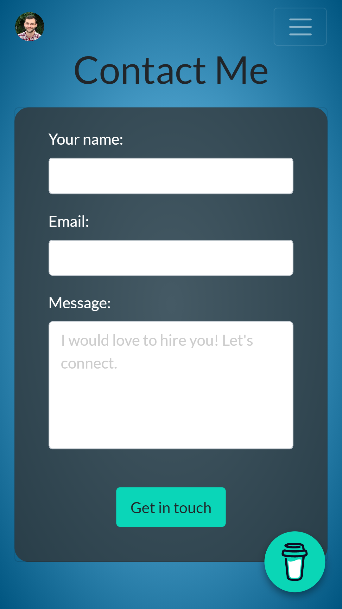
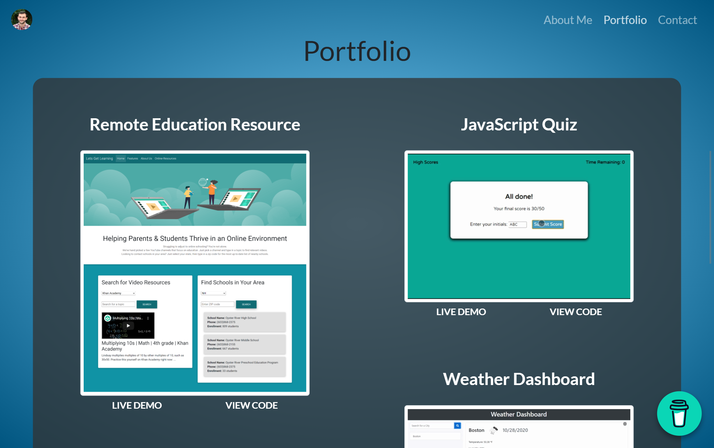

# Portfolio

  
  

### _Responsive portfolio website with bio, fetured projects, and contact form_

---
Currently deployed at [GitHub Pages](https://joeldore.github.io/Portfolio/)

## Screenshots

---
## Features

- Responsive navbar with links to About Me, Portfolio, and Contact sections
- Responsive grid of featured projects, each with a brief title, a screenshot/gif preview, and links to live deployment/GitHub repo
- Buy Me A Coffee&trade; widget

---
##  License
This project is [MIT](https://github.com/JoelDore/Portfolio/blob/main/LICENSE) licensed.  
© 2020 [Joel Dore](https://github.com/JoelDore)  

---
 

 
 

