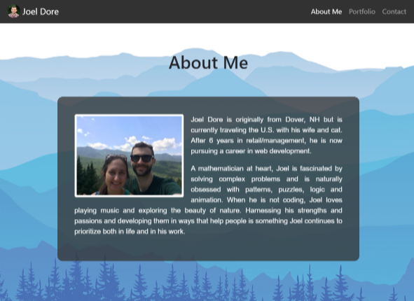
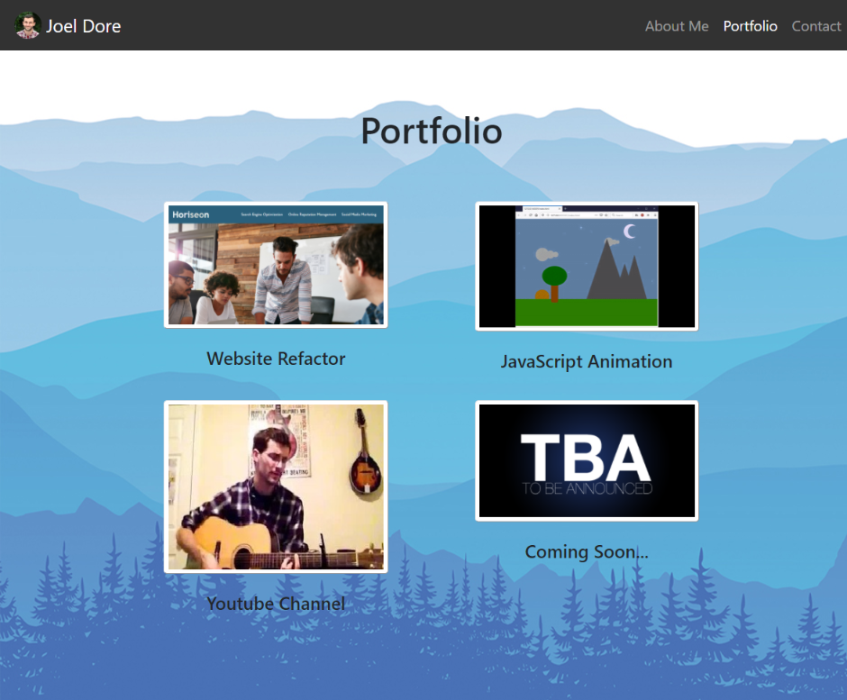
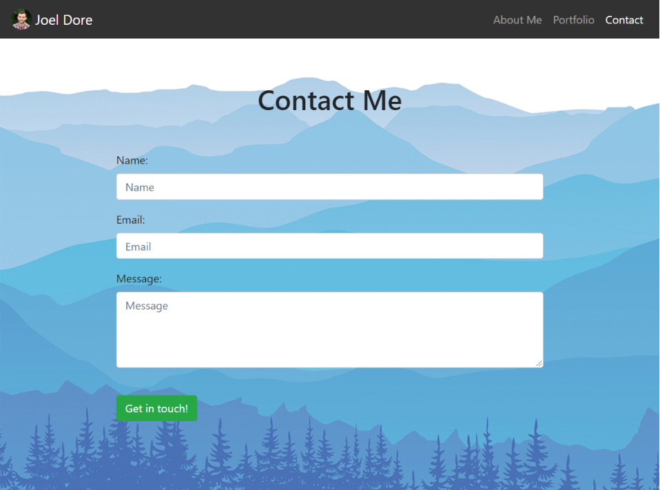

# Portfolio-Website

Responsive portfolio design

Deployed on [GitHub Pages](https://joeldore.github.io/Portfolio-Website/)

## Description

Portfolio website using Bootstrap for a responsive, mobile-first layout.
Contains three main pages:
* About Me
    * Short bio text that responsively wraps around an image.
* Portfolio
    * Responsive grid of portfolio items; stretched links to various projects
* Contact
    * Contact form with `mailto` link to send me an email

## Test Screenshots

### Badges
   
  