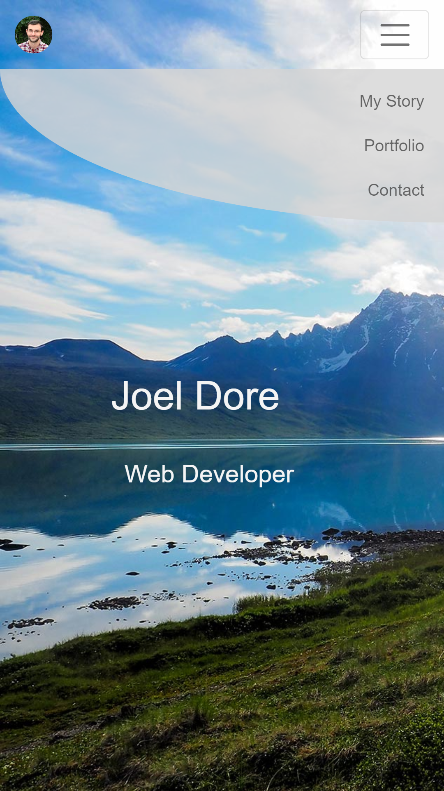
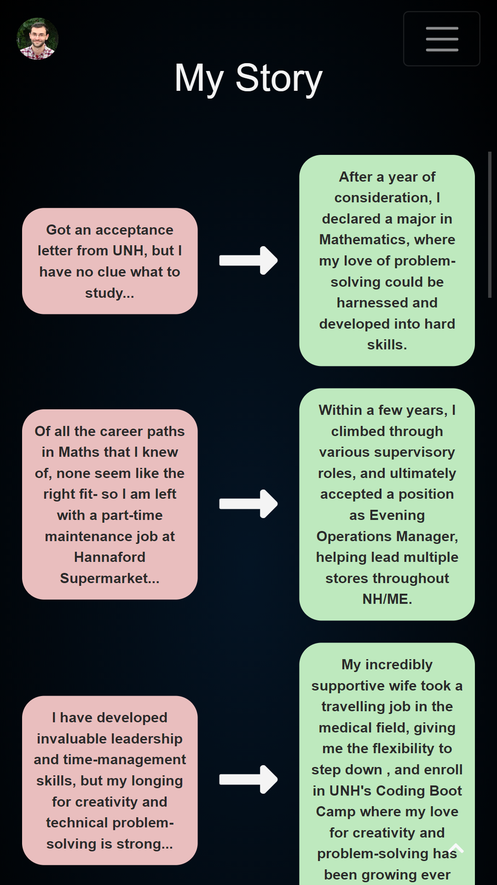
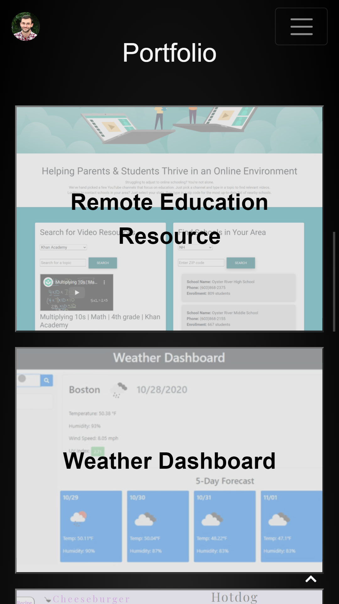
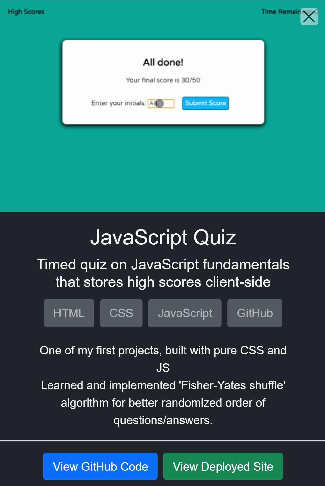
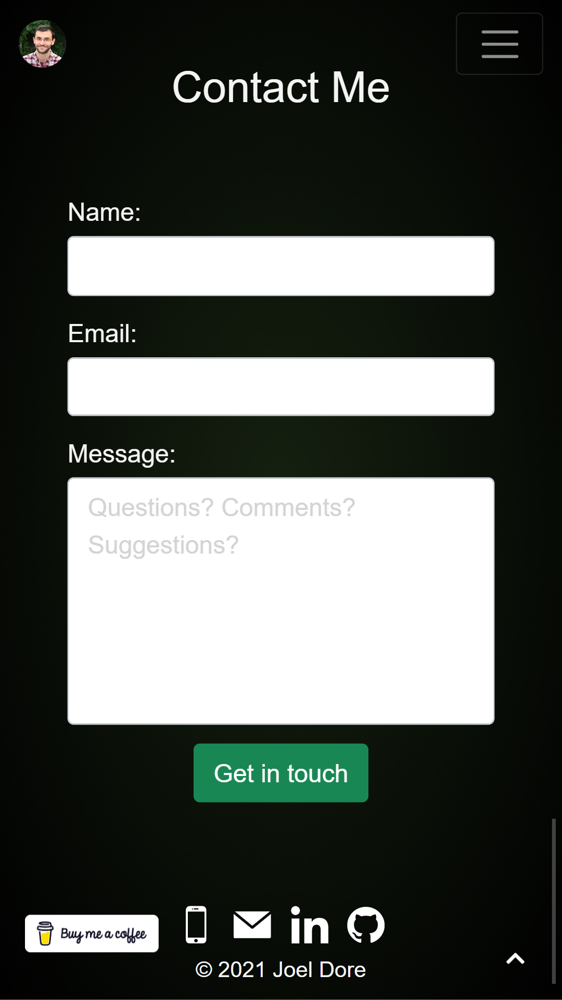
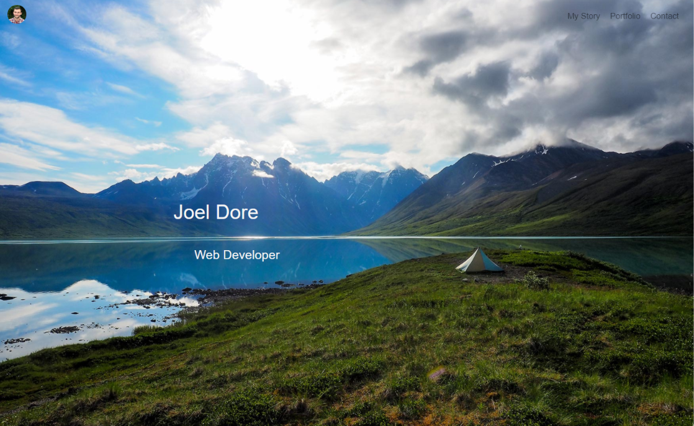
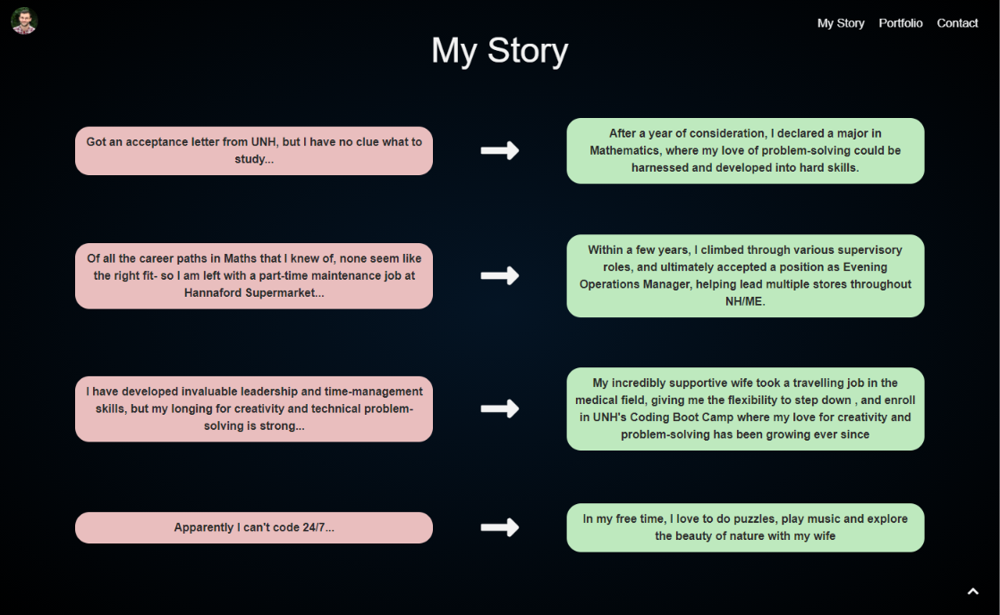
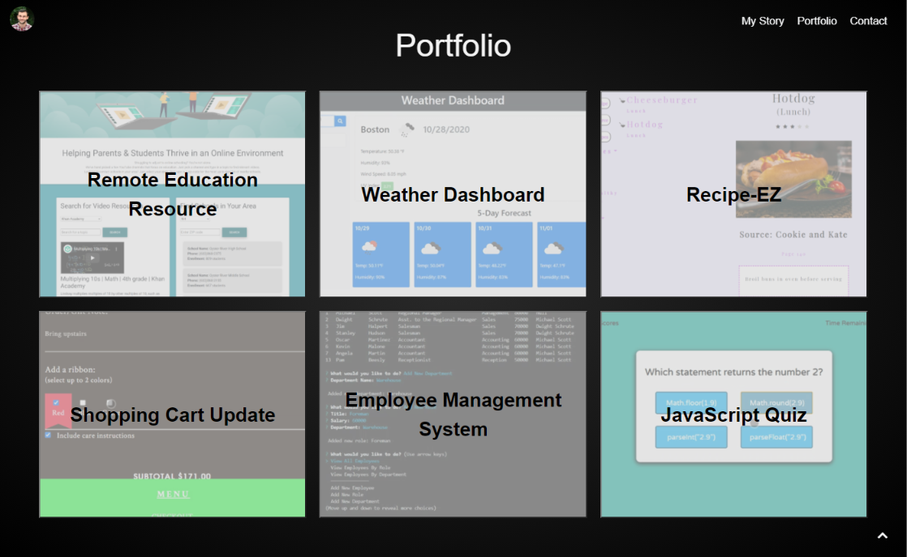
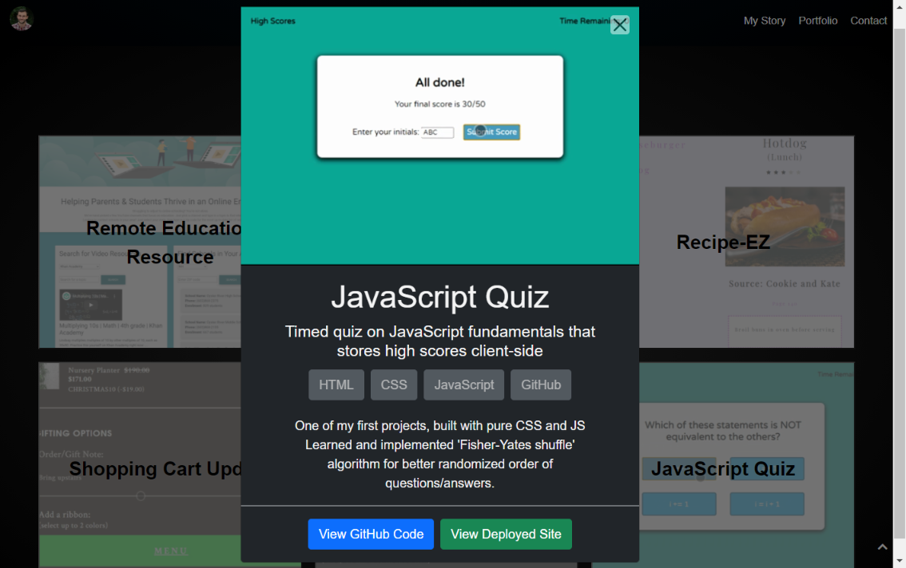
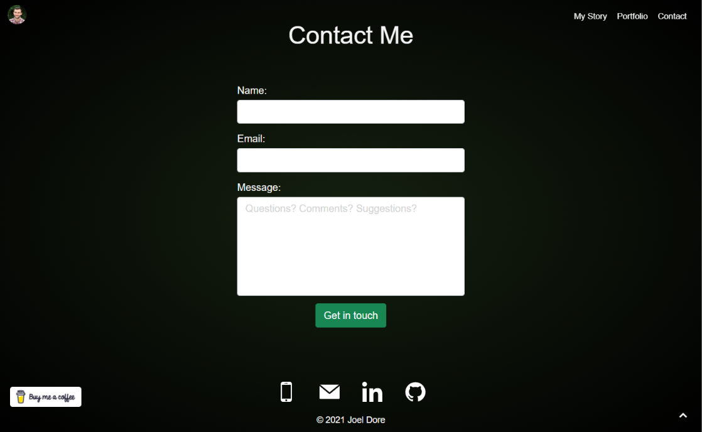

# Personal Portfolio

  
  

## _Responsive portfolio website_

---
## Mobile

## Desktop

---
Currently deployed at [GitHub Pages](https://joeldore.github.io/Portfolio/)

This project is [MIT](https://github.com/JoelDore/Portfolio/blob/main/LICENSE) licensed.  
© 2021 [Joel Dore](https://github.com/JoelDore)  

---
 

 
 

